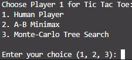
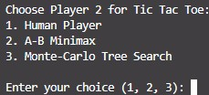
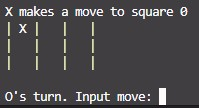
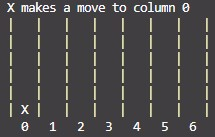
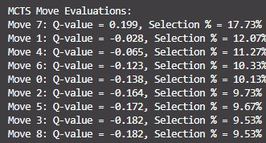
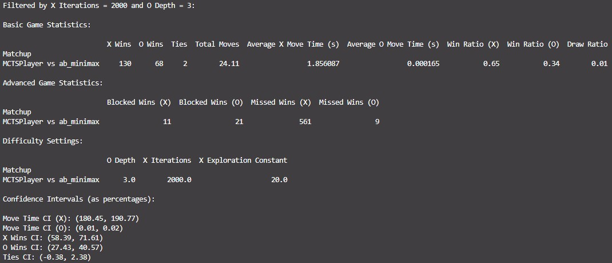

# Final Project 2025 

## A comparison study between Monte-Carlo Tree Search and Alpha Beta Minimax on Low and Medium Complexity Games
 
## Overview
This project focuses on gauging the performance between MCTS and a-b minimax in low to medium level complexity environments.
This is accomplished by using a determinstic environment to provide a stable and equal environment for both agents to express their capabilities without hindrance, as to allow their skills to speak for itself. The environment in question are 2 games. With Tic-Tac-Toe representing the low complexity side of things and Connect 4 representing medium complexity. Data is logged and presented in a csv where the user can then interact with it to view the results of their many iterations and draw conclusions. 

## To Enter the Environment
1. **Clone the repository**:
   ```sh
   git clone https://github.com/DavidZaki2004/Final-Project-2025.git
   cd Final-Project-2025

or download the zipfile and unzip it for easy immediate access

## Install Required Dependencies 
*pip install -r requirements.txt*

## To play a Game
Input the following command: *python game.py*

You will be met with this menu: 

 

Follow the steps as instructed to enter the type of match you'd like to see.

Then you will be asked to pick your game type 


After choosing the game type, you will see these 2 menus: 

 

## In-game view
Tic-Tac-Toe board: 



The board is a 3x3 block with 9 total spaces split up into 9 values starting from the top left (0) and ending in the bottom right (8). The user is expected to input a value between 0 - 8 where an error message will appear if the spot is taken already or does not exist on the board.

Connect4 board: 



The board is split up into 7 columns, starting from 0 - 6. The user picks a value from 0 - 6 and that is where their token/coin will drop. 

**It is important to keep these values in mind for smooth playing experience!**

If you have chosen to play against MCTS or against Minimax, a move evaluation output exists to help illustrate the mathematics going on in the background. It will be show up as so:




## Data and Tables
To access the tables and/or the raw data you could visit the *game_result.csv* file where any completed game is logged there with relevant data. Otherwise you could use the command *python table.py* in the terminal to generate a table that contains all the relevant data for the chosen categories (csv headers), the tables display various pieces of information as to try and provide a coherent breakdown of information to allow for easier digestion of all the information.
